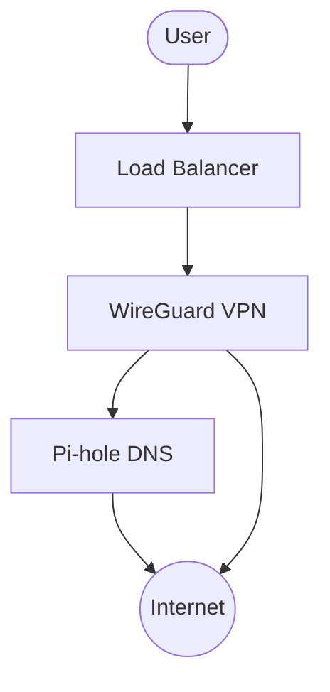

# GKE WireGuard + Pi-hole Stack

This repository contains Terraform code to deploy a self-hosted VPN solution using WireGuard (via wg-easy) and Pi-hole DNS adblocker on Google Kubernetes Engine (GKE).

## Architecture

- **GKE Cluster**: Cost-optimized cluster with e2-micro instances
- **WireGuard**: Deployed via wg-easy for easy client management
- **Pi-hole**: DNS adblocker with persistent storage
- **Networking**: Proper firewall rules and service exposure
- **Security**: Least privilege IAM and secure admin access



## Prerequisites

### 1. Required Tools

**macOS (Homebrew):**
```bash
brew install terraform google-cloud-sdk kubernetes-cli helm
```

**Ubuntu/Debian:**
```bash
# Install Terraform, GCloud CLI, kubectl, and Helm
# (Refer to official documentation for latest repository setup)
sudo apt install terraform google-cloud-cli kubectl helm
```

### 2. Google Cloud Platform Setup

1.  **Project**: Create or select a GCP project.
2.  **Billing**: Enable billing for the project.
3.  **Auth**:
    ```bash
    gcloud auth login
    gcloud auth application-default login
    ```

## Quick Start

1.  **Set Environment Variables**:
    ```bash
    export GOOGLE_PROJECT="your-project-id"
    export GOOGLE_REGION="us-central1"
    ```

2.  **Initialize and Apply Terraform**:
    ```bash
    # Initialize Terraform
    terraform init

    # Plan deployment
    terraform plan -var="project_id=${GOOGLE_PROJECT}" -var="region=${GOOGLE_REGION}"

    # Apply deployment
    terraform apply -var="project_id=${GOOGLE_PROJECT}" -var="region=${GOOGLE_REGION}"
    ```

3.  **Configure kubectl**:
    ```bash
    gcloud container clusters get-credentials wireguard-cluster --region=${GOOGLE_REGION}
    ```

4.  **Get Service IPs**:
    ```bash
    # WireGuard UI
    kubectl get svc wg-easy -n vpn -o jsonpath='{.status.loadBalancer.ingress[0].ip}'
    
    # Pi-hole Admin
    kubectl get svc pihole-serviceTCP -n dns -o jsonpath='{.status.loadBalancer.ingress[0].ip}'
    ```

## Operations & Configuration

### WireGuard Setup
1.  Open the WireGuard UI IP (default port 51821) in your browser.
2.  Login with password (default: `ChangeMePlease123!`). **Change this in `terraform.tfvars` before deploying for production.**
3.  Create a client and download the `.conf` or scan the QR code.

### Pi-hole Setup
1.  Open the Pi-hole Admin IP (`/admin`) in your browser.
2.  Login with password (default: `ChangeMePlease123!`).
3.  Configure Blocklists (Group Management > Adlists).

### Cost Optimization
This stack is optimizing for cost by default:
- **e2-micro instances**: ~$6-8/month per node.
- **Preemptible nodes**: Enabled by default for 60-90% savings.
- **Regional Persistent Disks**: Cost-effective storage.

To optimize further:
- **Scale Down**: Update `node_count` in `terraform.tfvars`.
- **Spot Instances**: Ensure `preemptible = true`.

## Security Best Practices

1.  **Change Passwords**: Never use the default passwords in production.
2.  **Restrict Access**: Update `authorized_networks` in `terraform.tfvars` to only allow your IP.
3.  **Private Nodes**: Set `enable_private_nodes = true` for enhanced security (requires Cloud NAT).
4.  **Network Policy**: Enabled by default (Calico) to isolate workloads.

## GKE Technical Details

### Kernel Module Support
WireGuard requires kernel modules (`NET_ADMIN`, `SYS_MODULE`). This setup automatically configures:
- Privileged containers for WireGuard.
- Ubuntu or COS images with necessary capabilities.

### Networking
- **VPC-native**: Uses Alias IPs for performant pod networking.
- **Firewall Rules**: Automatically creates rules for UDP:51820 (VPN) and TCP ports for Web UIs.

## Troubleshooting

### Pods Not Starting
**Symptoms**: `Pending` or `CrashLoopBackOff`.
**Fix**:
1. Check resources: `kubectl describe nodes`.
2. Check logs: `kubectl logs -n vpn deployment/wg-easy`.
3. If "Insufficient cpu/memory", try upgrading `machine_type` in `terraform.tfvars`.

### Services Pending External IP
**Symptoms**: External IP stays `<pending>`.
**Fix**:
1. Check quotas in GCP Console (IP addresses).
2. Ensure you haven't hit the limit for confirming LoadBalancers.

### VPN Connects but No Internet
**Fix**:
1. Check `sysctl` settings on nodes: `kubectl get daemonset`.
2. Verify Firewall rules allow `0.0.0.0/0` (or your IP) on UDP:51820.
3. Check Pi-hole is running: `kubectl get pods -n dns`.

### Diagnostics Commands
```bash
# Check all resources
kubectl get all -A

# Check node status
kubectl get nodes -o wide

# Check logs
kubectl logs -l app=wg-easy -n vpn
kubectl logs -l app=pihole -n dns
```

## Cleanup

To remove all resources and stop billing:
```bash
terraform destroy -var="project_id=${GOOGLE_PROJECT}" -var="region=${GOOGLE_REGION}"
```
